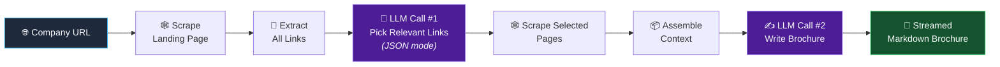

<div align="center">

# 🔥 Browse Forge

### *Forge stunning company brochures from any website - powered by AI*

[](https://www.python.org/)
[](https://platform.openai.com/)
[](https://jupyter.org/)
[](LICENSE)
[](https://github.com/namitrathod/Browse_Forge/pulls)

**Point it at any company website → get a polished, investor-ready brochure in seconds.**

[✨ Features](#-features) · [🚀 Quick Start](#-quick-start) · [🏗️ Architecture](#️-how-it-works) · [🎬 Demo](#-demo) · [🗺️ Roadmap](#️-roadmap)

</div>

---

## 💡 The Problem

Writing a company brochure means digging through dozens of pages — About, Careers, Products, Blog — and distilling it all into something people actually want to read. That's hours of manual work.

**Browse Forge does it in one function call.** It scrapes the site, uses an LLM to *intelligently decide which pages matter*, reads them, and writes the brochure for you streamed live with a typewriter effect. ⚡

---

## ✨ Features

| | Feature | Description |
|---|---|---|
| 🧠 | **AI-Powered Link Triage** | GPT-4o-mini reads every link on the landing page and picks only the ones worth reading About, Careers, Company while skipping Terms, Privacy & mailto noise |
| 🕸️ | **Smart Web Scraping** | BeautifulSoup-based scraper that strips scripts, styles & images to extract clean, readable text |
| 📋 | **Structured JSON Outputs** | Uses OpenAI's JSON mode for reliable, schema-consistent link selection no regex parsing hacks |
| ⌨️ | **Live Streaming Output** | Watch the brochure being written token-by-token with a satisfying typewriter animation |
| 📝 | **Beautiful Markdown** | Brochures render instantly as formatted Markdown, ready to copy anywhere |
| 🔌 | **Model-Agnostic Design** | One `MODEL` constant swap in any OpenAI chat model in a single line |

---

## 🏗️ How It Works

Browse Forge runs a **two-stage LLM pipeline** the first call *plans*, the second call *writes*:



<details>
<summary><b>🔍 Stage 1 Smart Link Selection (click to expand)</b></summary>
<br/>

The landing page is scraped and **every hyperlink is extracted**. Instead of blindly crawling everything, GPT-4o-mini is prompted with the full link list and asked to return *only* brochure-relevant pages as structured JSON:

```json
{
    "links": [
        {"type": "about page", "url": "https://full.url/goes/here/about"},
        {"type": "careers page", "url": "https://another.full.url/careers"}
    ]
}
```

This is a real-world example of **using an LLM as a decision-making component** inside a pipeline — not just a text generator. It also handles relative → absolute URL resolution reasoning for free. 🎯

</details>

<details>
<summary><b>✍️ Stage 2 Brochure Generation (click to expand)</b></summary>
<br/>

The landing page + every selected page get scraped and stitched into a single context document. GPT-4o-mini then writes a short, punchy brochure covering:

- 🏢 What the company does
- 🎨 Company culture
- 🤝 Customers & partners
- 💼 Careers & open roles

Context is truncated to **5,000 characters** to keep calls fast and cheap a deliberate cost/latency trade-off you can tune. 💸

</details>

---

## Example

```python
# 🔨 One-shot generation
create_brochure("HuggingFace", "https://huggingface.co")

# ⌨️ Or stream it live with a typewriter effect
stream_brochure("HuggingFace", "https://huggingface.co")
```


---

## 🚀 Quick Start

### 1️⃣ Clone

```bash
git clone https://github.com/namitrathod/Browse_Forge.git
cd Browse_Forge
```

### 2️⃣ Install

```bash
pip install openai python-dotenv requests beautifulsoup4 ipython jupyter
```

### 3️⃣ Configure

Create a `.env` file in the project root:

```env
OPENAI_API_KEY=sk-proj-your-key-here
```

> 🔑 Get your API key at [platform.openai.com/api-keys](https://platform.openai.com/api-keys)

### 4️⃣ Forge! 🔥

```bash
jupyter notebook
```

Run the cells top to bottom, then point `stream_brochure()` at **any company on the internet**.

---

## 🧩 Core Components

| Component | Role |
|---|---|
| 🕸️ `Website` | Scraper class — extracts title, cleaned body text & all hyperlinks from a URL |
| 🔗 `get_links(url)` | **LLM Call #1**  returns brochure-worthy links as structured JSON |
| 📦 `get_all_details(url)` | Aggregates landing page + selected pages into one context blob |
| 📄 `create_brochure(name, url)` | **LLM Call #2** generates & renders the brochure |
| ⌨️ `stream_brochure(name, url)` | Same, but streamed live with typewriter animation |

---

## 🛠️ Tech Stack

<div align="center">


</div>

---

## ⚠️ Known Limitations

- 🖥️ **JavaScript-heavy sites** may return limited content (scraper is HTML-only no headless browser yet)
- ✂️ **5,000-character context cap** very large sites get truncated (tunable in `get_brochure_user_prompt`)
- 🌐 Some sites block scrapers despite the browser `User-Agent` header

---

## 🗺️ Roadmap

- [ ] 🤖 Multi-provider support, Claude, Gemini & local models via Ollama
- [ ] 🎨 Export to PDF / styled HTML
- [ ] 🌍 Multi-language brochure generation
- [ ] 🖼️ Gradio / Streamlit web UI
- [ ] 🕷️ Headless-browser scraping for JS-heavy sites (Playwright)
- [ ] 🎭 Tone presets — *humorous*, *formal*, *startup-pitch* brochure styles

---

## 🤝 Contributing

Contributions make open source awesome! 💪

1. 🍴 Fork the repo
2. 🌿 Create your branch `git checkout -b feature/amazing-idea`
3. ✅ Commit `git commit -m "Add amazing idea"`
4. 🚀 Push `git push origin feature/amazing-idea`
5. 🎉 Open a Pull Request

---

## 📄 License

Distributed under the **MIT License** free to use, modify & share.

---

<div align="center">

### ⭐ If Browse Forge saved you time, drop a star, it fuels the forge! ⭐

**Built with 🔥 by [Namit Rathod](https://github.com/namitrathod)**

[](https://github.com/namitrathod)

</div>
